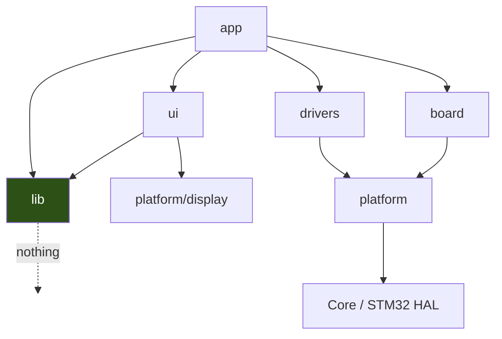

# DIY Hot Plate — Improvements Backlog

Consolidated to-do list. Everything here was identified during the CubeIDE → CMake
migration and the first hardware bring-up session, and is **not yet done**.

Tick items off as you go. Rough sizing: **S** < 1h, **M** a few hours, **L** a day+.

---

## Status snapshot

| | |
|---|---|
| Branch | `feat/new_sw_arch` |
| Toolchain | STM32CubeCLT 1.22.0 — arm-none-eabi-gcc 14.3.1, C++17 |
| Build | `cmake --preset Debug` / `cmake --build --preset Debug` |
| Flash | `cmake --build --preset Debug --target flash` |
| Debug image | 65448 / 65536 B flash (**99.87%**), 4152 / 20480 B RAM |
| Release image | 51152 / 65536 B flash (78.1%) |

### Already fixed (for reference — do not redo)

- [x] `BUZZER_tone` 1000× unit error (`durationSeconds*1000` → `durationMs`)
- [x] `DEBUG_STRING` defined in a header → `extern` + one definition (GCC 10+ `-fno-common`)
- [x] `hot_plate.h` extern block so `hot_place.cpp` compiles at all *(workaround — see A6 for the real fix)*
- [x] Migration to `Core/`, C++ enabled, all app sources in the build
- [x] `-u _printf_float` so the OLED shows numbers
- [x] `flash` CMake target (software reset via `DEMCR`/`AIRCR`, no NRST wire needed)

---

## 0. Safety — do these first

The plate reaches 230 °C and the SSR is driven by TIM2 **in hardware**, independently
of the CPU. If the core dies mid-ramp, the heater stays at its last duty cycle forever.

- [ ] **S — Turn the SSR off in every fault path.** `Error_Handler()` is
      `__disable_irq(); while(1){}` and `HardFault_Handler` is a bare `while(1)`.
      Neither touches the SSR. Write `CCR1 = ARR` (or disable the timer) before halting.
- [ ] **S — Enable the IWDG.** The `.ioc` peripheral list is ADC1, I2C1, NVIC, RCC, SYS,
      TIM1, TIM2, USART1 — there is no watchdog at all. A stalled loop currently heats forever.
- [ ] **M — Add a real `HardFault_Handler`** that captures the stacked `PC`/`LR` plus
      `SCB->CFSR`/`HFSR`/`BFAR`, so faults become an address you look up in the `.map`
      instead of a guess.
      ```c
      __attribute__((naked)) void HardFault_Handler(void)
      {
          __asm volatile ("tst lr, #4      \n"
                          "ite eq          \n"
                          "mrseq r0, msp   \n"
                          "mrsne r0, psp   \n"
                          "b hard_fault_report\n");
      }
      ```
- [ ] **M — Sensor plausibility check + max-temperature interlock.** If the NTC opens or
      shorts, `readCelsius()` returns garbage and the controller commands full power.
      There is currently nowhere natural to put this — see A5.

---

## 1. Correctness bugs

- [ ] **S — `print_chart_NewPoint` writes out of bounds.** `arrayIndex++` with no bound
      against `numPoints` (300). Walks up through `main()`'s frame and off the top of RAM.
      **Expect a HardFault ~10–13 min after boot.**
      [app/menu/graph_lib/graph_chart.c](app/menu/graph_lib/graph_chart.c)
      ```c
      if (myChart->arrayIndex + 1U >= myChart->numPoints) { myChart->arrayIndex = 0U; }
      myChart->arrayIndex++;
      ```
      Note it also pre-increments, so index 0 is never used.
- [ ] **S — `seconds` drifts ~1.9× vs wall clock.** Measured: `uwTick` 24.1 s while
      `seconds` = 12.5. `refreshDisplay()` blindly adds `refresh_rate/1000` per call, but
      the real loop period is `delay(500)` + ADC poll + I²C frame + button delays.
      **Your reflow profile runs at roughly double its intended duration** — this affects
      solder joint quality. Derive `seconds` from `HAL_GetTick()` instead.
- [ ] **S — `running_mode` never leaves `REFLOW`.** The transition is commented out in
      `reflow()`, so after the profile ends the loop plots forever:
      ```c
      temp_setpoint = 0.0;
      //running_mode = hotPlateState_TRANSITION;   // <-- re-enable
      ```
- [ ] **S — Stack reservation is too small.** `_Min_Stack_Size = 0x400` (1024 B) but
      `main()` needs **1600 B** (from `-fstack-usage`). Harmless today because 16.8 KB of
      RAM below it is unused, but `_sbrk`'s heap ceiling (`_estack - 0x400`) sits *above*
      the live stack pointer, so any real heap growth would run into the stack.
      Fix properly by moving `chart_xAxis`/`chart_yAxis` and the widget structs to
      file-scope `static` (they're pointed to by a global anyway).
- [ ] **S — `min`/`max` macros are unparenthesised.** `#define min(a,b) a<=b? a : b` in
      [api/api.h](api/api.h). `min(seconds*t/s, t)` does not expand the way you want.
      Replace with `constexpr` functions.
- [ ] **S — `analogRead()` ignores its `channel` argument.** `ADC_select_CH2()` is
      commented out; it works only because ADC1 rank 1 happens to be the thermistor.
      Add a second analog input and you get silently wrong temperatures.
- [ ] **S — `analogWrite()` has no `CCR` vs `ARR` clamp.** Values above `ARR` stick the
      PWM at 100%.
- [ ] **M — PID is not a correct PID.** No `dt` on the derivative (so `Kd` is coupled to
      loop timing, which isn't constant), no anti-windup on the integrator itself
      (clamping is applied to the sum only, so `PID_I` dominates during the ramp).
      Best fixed as part of C1.

### Hardware — blocked on you

- [ ] **Determine button polarity.** All four read **LOW** at idle with pull-ups
      confirmed enabled (`GPIOA_IDR=0xD8E3`, `GPIOB_IDR=0x3FE3`, `GPIOC_IDR=0x8000`,
      `ODR` bits set). Firmware assumes active-low, so it trips the sw3/sw4 handlers once
      at boot and then latches `but_N_state = false` forever — **the buttons are
      effectively dead**. Either they're wired active-high with external pull-downs
      (→ `GPIO_PULLDOWN` + invert the `digitalRead` tests) or something is shorting them.
      Meter PB15 to GND with nothing pressed.
- [ ] **Check the thermistor reference resistor.** `#define REFERENCE_RESISTANCE 10000//4700`
      — that trailing comment suggests the real part may be 4.7 kΩ. Board reads 15.2 °C;
      if the room isn't 15 °C, this is why.

---

## 2. Flash & memory budget

Debug is at **99.87%** — 88 bytes free. Nothing else fits until this is addressed.

Largest symbols in the Release image:

| Symbol | Bytes | Used for |
|---|---:|---|
| `u8g2_font_siji_t_6x10` | **10624** | splash screen — **one glyph** |
| `_dtoa_r` | 3020 | float printf |
| `u8g2_font_ncenB14_tr` | 2129 | "COMPLETE" — in an **unreachable** state |
| `u8g2_font_helvR10_tr` | 1320 | splash screen "Hello World!" |
| `u8g2_font_ncenB08_tr` | 1192 | the text bar — **the only one needed** |
| `__ieee754_log` + double soft-float | ~2800 | `NTC_Thermistor` using `double`/`log()` |

- [ ] **S — Delete the splash screen** (`siji` + `helvR10`) → **frees ~11.9 KB**
- [ ] **S — Use `ncenB08` instead of `ncenB14`** for "COMPLETE" → **frees ~2.1 KB**
- [ ] **S — Delete the unused 1 KB `bitmap[]` array** in `main.cpp` (already warned about)
- [ ] **M — `double`/`log()` → `float`/`logf()`** in `NTC_Thermistor` → **frees ~2–3 KB**
      and is much faster on an FPU-less M3. Do this as part of C1.
- [ ] **Later — drop float printf entirely**, format with integer math (`%d.%d`).
      Zero cost, and the correct embedded answer. Keep `-u _printf_float` for now while
      you still need to see what the controller is doing.

---

## 3. Architecture refactor

### Target structure

```
diy_hot_plate/
├── Core/                  CubeMX-owned. Never hand-edited.
├── cmake/
├── board/                 ALL wiring for this PCB, single source of truth
│   └── hot_plate_v1.c/h   pin objects, peripheral handles, init sequence
├── platform/              the ONLY code that includes stm32f1xx_hal.h
│   ├── gpio.c/h           one abstraction, one vocabulary
│   ├── pwm.c/h            with the missing CCR-vs-ARR clamp
│   ├── adc.c/h            honours its channel argument
│   └── time.h             delay/millis
├── drivers/               devices; depend only on platform/
│   ├── buzzer/  led/  ntc_thermistor/  max6675/
├── lib/                   PURE. No HAL, no globals. Host-buildable.
│   ├── pid/               takes dt, clamps its own integrator
│   └── reflow_profile/    setpoint_at(profile, t)
├── ui/                    was app/menu/graph_lib
│   ├── widget.c/h  chart.c/h  list.c/h
│   └── screen.c/h         owns the u8g2 instance; nobody else sees it
├── app/
│   ├── hotplate.c/h       state machine owning a hotplate_t
│   └── app.c              composition root
├── third_party/
│   └── u8g2/              pinned submodule + LICENSE
└── tests/                 host build: Unity/GoogleTest + ASan/UBSan
```

### The rule that makes it work — dependencies point downward only



`lib/` depending on **nothing** is the point: it's what makes `pid` and
`reflow_profile` compilable with host GCC, which unlocks unit tests, ASan, and the
PID tuning harness.

### Current violations

- `api/` is four unrelated things at once: HAL shims, device drivers, vendored
  libraries, and cross-cutting services.
- **Two competing GPIO abstractions** — `api_hal_gpio.c` (`digitalWrite`/`digitalRead`)
  and `api/gpio/gpio.c` (`gpio_write`/`gpio_set`/`gpio_read`). Both one-line wrappers
  over the same HAL calls. Different modules picked different ones.
- **`ui` reaches up into `app`** — `graph_text_bar.c` declares
  `extern float temperature`, `extern hotPlateState_e running_mode`, `extern pwm_t SSR`.
  A generic widget library knows about reflow domain concepts and holds a PWM handle.
- **`graph_chart.c` does `extern u8g2_t u8g2`** — welded to one global display instance.
- **`bsp/` is bypassed** — declares 12 init functions, implements 3.
  `BSP_IrqMapping_Init()` is declared but never defined, so `irqMap[17]` is all-NULL.
  Meanwhile `main.cpp` declares its own pin objects and `BSP_buzzer_Init()` duplicates
  the `BUZZER_PIN` literal.
- **`main.cpp` does five jobs**: composition root, pin definitions, u8g2 I²C transport,
  the whole display layer, 25 mutable globals, and the scheduler.
- **~⅓ of `api/` is dead**: `led_portExp.c`, `max6675.c`, `AverageThermistor.cpp`,
  `SmoothThermistor.cpp`, `interupts_callbacks.c` (no EXTI is ever configured),
  `api.c` (10 lines of nothing), plus `Core/Src/main.c`.
- **Naming**: `led_ctorGPIO` / `buzzer_ctor` / `thermocouple_max6675_ctor`;
  `hot_place.cpp` vs `hot_plate.h`; `interupts_callbacks.c` (typo);
  `NTC_Thermistor_hpp` (folder named after a file extension); `thermocouple-k-type`
  (kebab-case among snake_case).

### Migration steps — each keeps the tree building

- [ ] **A1 — S — Delete the ~7 dead files.** Free win, smaller build.
- [ ] **A2 — S — Collapse the two GPIO abstractions** into `platform/gpio`.
- [ ] **A3 — S — Move `u8g2/` → `third_party/`** and fix include dirs. This finally kills
      the `"../api/u8g2/u8g2.h"` hack in `graph.h` that only resolves via a
      `-I${CMAKE_SOURCE_DIR}/app` accident.
- [ ] **A4 — M — Move every pin/handle definition into `board/`**, delete them from
      `main.cpp`. One source of truth; kills the duplicated `BUZZER_PIN`.
- [ ] **A5 — M — Extract `lib/pid` + `lib/reflow_profile`** as pure, hardware-free code.
      **This is the enabling step for everything in sections 4–6.** Also the natural home
      for the `dt` fix, the anti-windup fix, and the safety interlock.
- [ ] **A6 — M — Give hot_plate a `hotplate_t` context + accessors; delete both extern
      blocks.** This is the *proper* fix for the `hot_place.cpp` problem — the current
      `extern` block in `hot_plate.h` is a workaround in which a module's header declares
      objects that its own caller defines, which is backwards.
      ```c
      void            hotplate_init(hotplate_t *hp, const TempProfile_t *profile);
      void            hotplate_step(hotplate_t *hp, float dt_s, float measured_c);
      hotPlateState_e hotplate_state(const hotplate_t *hp);
      float           hotplate_temperature(const hotplate_t *hp);
      ```
      `graph_text_bar.c` then calls accessors instead of carrying its own externs.
- [ ] **A7 — M — Make `ui/` take a `const hotplate_t*`**; move the `u8g2` instance into
      `ui/screen.c`. Dependencies finally point downward.
- [ ] **A8 — S — `main()` becomes `app_init(); for(;;) app_step();`**
      Stack drops from 1600 B to tens of bytes — **this also resolves item 1.4.**

---

## 4. C++ study track — embedded subset (on-target)

The half of C++ that genuinely pays off on a 20 KB Cortex-M3. Do these *after* A1–A5.

- [ ] **C1 — M — `constexpr` everywhere it belongs.**
      `buzzer.c` has `PSC = 282352/frequency/2` — an unexplained magic constant doing a
      runtime division. Derive it from `SystemCoreClock` at compile time.
      Also: `hot_plate.h` declares `static const TempProfile_t ...` in a header, which
      means **internal linkage — one copy per translation unit**. C++17 `inline constexpr`
      gives exactly one, or zero if it folds.
- [ ] **C2 — M — Strong types / units.** The highest-*safety* return on this list.
      You currently have `float seconds`, `float temperature`, `float temp_setpoint`,
      `float pwm_value`, `float refresh_rate` — all mutually assignable.
      **The `BUZZER_tone` bug that cost 7.5 minutes per boot was exactly a units error
      that a `Milliseconds` type would have made a compile error.**
- [ ] **C3 — S — `enum class`.** `main.cpp` literally contains `if(running_mode == 0)`
      next to `running_mode == hotPlateState_COOLDOWN` elsewhere. Pair with `-Wswitch-enum`
      and the compiler starts reporting forgotten states.
- [ ] **C4 — L — Templated GPIO as zero-cost abstraction.** *The* embedded C++ technique.
      `io_pin_t ssr_pin = {GPIO_PIN_15, GPIOA}` is a runtime struct; every `digitalWrite`
      loads port and pin from RAM. `template<uintptr_t Port, uint16_t Pin> struct Gpio`
      compiles `Gpio<GPIOA_BASE,15>::set()` to a single `str`. Do this *after* tests exist.
- [ ] **C5 — M — RAII for hardware, not memory.** `Error_Handler()` calls
      `__disable_irq()` and never re-enables. A `CriticalSection` guard makes that
      structurally impossible. Same for I²C transactions and PWM enable/disable.
      Note these guards must be non-copyable **and non-movable** — writing `= delete` on
      all five special members is the lesson.
- [ ] **C6 — M — `std::array` / `std::span`.** `int16_t chart_xAxis[300]` decays to a
      pointer the moment it's passed, which is exactly why `print_chart_NewPoint` can
      `++` past the end. `std::span` carries the size across function boundaries.
- [ ] **C7 — M — Convert the widget layer to classes.** `container_of` **is** manual
      virtual dispatch; in C++ it ceases to exist because the compiler adjusts `this`.
      And it's **smaller**: `graphicalObject_t` stores two function pointers (8 B/object)
      where a vptr is 4 B with the functions in a shared vtable, and `char name[16]`
      becomes a `const char*`. **36 B → ~20 B per widget.**
      Use `virtual` here, not CRTP — `graphicalObject_t* pGObjArray[2]` is a heterogeneous
      array, which *requires* runtime polymorphism. Save devirtualization for `Thermistor`
      (three pure virtuals, one implementation).
      With `-fno-rtti` and nothing deleted through a base pointer, make the destructor
      `protected` and non-virtual — saves a vtable slot and documents "no polymorphic delete".
      Bugs this removes: uninitialised `menuList`/`menuList1` (the only widgets *not*
      `memset`), the null `input` function pointer in `print_window`, the two-different-
      `draw`s on `chart_t`, and the `(itemName_t*)"op1"` double-cast chain.

---

## 5. C++ study track — move semantics & smart pointers (host-side)

**Honest framing: nothing you can add to the STM32 side makes smart pointers or move
semantics genuinely necessary.** With 20 KB of RAM, no MMU and unrecoverable
fragmentation, every correct design converges on static allocation. Practising them
on-target would teach the idiom in a context where it's wrong.

The host-side half of this project is where they're unavoidable *and* useful.

- [ ] **M1 — S — Measure the one real `new`.** `main.cpp` has
      `Thermistor* therm1 = new NTC_Thermistor(...)`, never deleted. Run the experiment
      and record `--print-memory-usage` at each step:
      1. baseline (65448 B flash / 4152 B RAM)
      2. → `std::unique_ptr<Thermistor>`
      3. → plain `static NTC_Thermistor therm1{...}`
      4. → devirtualise `Thermistor` entirely
      You'll see `unique_ptr` costs nothing in *size* over a raw pointer but still drags
      in the heap; the static object drops `malloc`/`free`; devirtualising drops the
      vtable and the indirect call. **Smart pointers taught empirically, with numbers.**
      Related trap already in your code: `therm1`'s constructor runs from
      `__libc_init_array` **before `HAL_Init()`** — the static initialization order
      fiasco, live on real hardware.
- [ ] **M2 — L — UART reflow logger + analyser (host).** *The best move-semantics exercise.*
      Stream `(t, temperature, setpoint, duty)` over USART1 (the UART path is already
      stubbed in `Error_Report.c`), capture and plot on the desktop.
      - a `SerialPort` RAII class owning a `HANDLE`/fd → **you write your own move
        constructor and move assignment**, and learn the rule of five and why a
        moved-from object needs a valid-but-empty state
      - `std::vector<Sample> parse(std::istream&)` returned by value → where RVO applies,
        where a move happens, and the cases where **neither** does
      - `push_back` vs `emplace_back` vs `push_back(std::move(r))` under a profiler
      **Real payoff: you currently have no idea whether your PID tracks the profile.**
- [ ] **M3 — L — Desktop UI simulator (u8g2 SDL target).** *The canonical `unique_ptr`
      exercise.* u8g2 ships an SDL frame-buffer target under `sys/sdl/` upstream (not in
      your vendored `csrc/` copy — 90 files, all `csrc/`).
      ```cpp
      struct SdlDeleter {
          void operator()(SDL_Window* w)   const { SDL_DestroyWindow(w); }
          void operator()(SDL_Renderer* r) const { SDL_DestroyRenderer(r); }
      };
      using WindowPtr = std::unique_ptr<SDL_Window, SdlDeleter>;
      ```
      That's `unique_ptr`'s actual purpose — **non-memory resource ownership with a custom
      deleter** — and because an `SDL_Window` can't be duplicated the type is inherently
      move-only, so you hit move semantics because the domain forces it.
      Payoff: develop the GUI with a debugger and ASan, no board attached. **It would have
      caught the `arrayIndex` overflow on the first run.** Also gives `ui/` a second
      consumer, which is what stops it regressing into `extern float temperature`.
- [ ] **M4 — L — Plant simulator + PID tuning harness.** Model the plate as a first-order
      lag with dead time, compile the real `lib/pid` against it, sweep Kp/Ki/Kd.
      Highest *engineering* value — tune without burning boards or waiting 5 min per run.

> **Note on the GUI and smart pointers:** the widget tree is a *non-owning* observer
> graph. `window_t::graphicalObjects` points at widgets it neither allocates nor frees,
> so raw pointers / `std::span<Widget* const>` are correct there — that's the C++ Core
> Guidelines position (R.3), not an embedded compromise. `unique_ptr` would only apply if
> parents owned heap-allocated children (the Qt model), which is the wrong model for 20 KB.
> **Classes alone are enough for the GUI — see C7.**

---

## 6. Profiling & tooling

Since there is essentially no dynamic allocation, "memory leak" isn't the failure mode —
**static footprint and stack depth** are. Prioritise accordingly.

### Static (highest value, no hardware)

- [ ] **P1 — S — [puncover](https://github.com/HBehrens/puncover).** `-fstack-usage` is
      already enabled in the toolchain file, so the `.su` files exist. Point puncover at
      the `.elf` for per-function stack bytes and a call-graph worst case.
      **This alone would have found the `main()` 1600 B problem immediately.**
- [ ] **P2 — S — `-Wstack-usage=512`.** Compiler *error* on any function over budget.
      Cheapest possible guardrail.
- [ ] **P3 — S — `-Wall -Wextra -Wconversion -Wdouble-promotion`.**
      `-Wdouble-promotion` flags every accidental `double` in the thermistor math.

### Static analysis & formatting

Both binaries already exist, bundled with the cpptools extension — nothing to install:

```
%USERPROFILE%\.vscode\extensions\ms-vscode.cpptools-1.34.4-win32-x64\LLVM\bin\
    clang-format.exe   (3.7 MB)
    clang-tidy.exe    (84.6 MB)
```

- [ ] **P4a — S — Add a `.clang-format`.** The tree has no formatting standard and it
      shows: `api/` uses hard tabs, `app/` uses 2 spaces, `Core/` uses CubeMX's 2-space
      style, brace placement varies per file, and `hot_place.cpp` mixes both.
      Start from a base and override minimally:
      ```yaml
      ---
      BasedOnStyle: LLVM
      IndentWidth: 4
      TabWidth: 4
      UseTab: Never
      ColumnLimit: 100
      PointerAlignment: Left
      AlignConsecutiveMacros: Consecutive
      AllowShortFunctionsOnASingleLine: Empty
      SortIncludes: false          # include order here is load-bearing, see A3
      ---
      Language: Cpp
      Standard: c++17
      ```
      **`SortIncludes: false` is deliberate** — `graph.h`'s `#include "../api/u8g2/u8g2.h"`
      only resolves through an `-I` accident, so reordering includes can break the build
      until **A3** is done. Re-enable it afterwards.
- [ ] **P4b — S — Exclude vendored code from formatting.** Add `.clang-format` with
      `DisableFormat: true` inside `api/u8g2/` (and `Drivers/`, `Core/`), or you will
      reformat 88 third-party files and make every future upstream diff unreadable.
- [ ] **P4c — S — Reformat in one dedicated commit**, then record it so history stays
      readable:
      ```
      git rev-parse HEAD > .git-blame-ignore-revs
      git config blame.ignoreRevsFile .git-blame-ignore-revs
      ```
      Otherwise `git blame` on every line points at the formatting commit. Do this
      **before** the A1–A8 refactor, so the reformat and the real changes don't mix.
- [ ] **P4d — S — Enable format-on-save for this workspace only:**
      ```jsonc
      "[c]":   { "editor.defaultFormatter": "ms-vscode.cpptools", "editor.formatOnSave": true },
      "[cpp]": { "editor.defaultFormatter": "ms-vscode.cpptools", "editor.formatOnSave": true },
      "C_Cpp.formatting": "clangFormat",
      "C_Cpp.clang_format_style": "file",
      ```
- [ ] **P5a — M — Get clang-tidy working for the ARM target.** It is currently
      **disabled** in `.vscode/settings.json`, and for a specific reason: cpptools runs
      clang-tidy as a *separate* analyzer that did not inherit the arm-none-eabi
      configuration, so it parsed CMSIS headers as host x86-64. The symptom was
      `size_t` resolving to `unsigned long long` and `cmsis_compiler.h` hitting its
      `#else #error Unknown compiler`, which left `__STATIC_INLINE` undefined and
      cascaded through all of `core_cm3.h`.

      Two ways to fix it properly:

      **Option 1 — standalone, most reliable.** Run against the compile database, where
      every flag including `-mcpu=cortex-m3` is already correct:
      ```powershell
      $tidy = "$env:USERPROFILE\.vscode\extensions\ms-vscode.cpptools-1.34.4-win32-x64\LLVM\bin\clang-tidy.exe"
      & $tidy -p build/Debug --extra-arg=--target=arm-none-eabi app/hot_plate/hot_place.cpp
      ```
      Wire it up as a CMake target next to `flash` so it is one command.

      **Option 2 — in-editor.** Re-enable `C_Cpp.codeAnalysis.clangTidy.enabled` and add
      `"C_Cpp.codeAnalysis.clangTidy.args": ["--extra-arg=--target=arm-none-eabi"]`.
      Verify against `Core/Inc/main.h` before trusting it.
- [ ] **P5b — S — Add a `.clang-tidy` config.** Start narrow; the full check set on this
      codebase will bury you:
      ```yaml
      Checks: >
        -*,
        bugprone-*,
        cert-*,
        clang-analyzer-*,
        misc-*,
        readability-non-const-parameter,
        -bugprone-easily-swappable-parameters,
        -readability-magic-numbers
      WarningsAsErrors: ''
      HeaderFilterRegex: '^(api|app|bsp|board|platform|drivers|lib)/'
      ```
      `HeaderFilterRegex` keeps it off `Drivers/`, `Core/` and `api/u8g2/`.
- [ ] **P5c — M — Known findings to expect**, all already identified by hand:
      unbounded `sprintf` into `DEBUG_STRING` (`cert-err33-c`, `bugprone-unsafe-functions`);
      `print_chart_NewPoint` writing past `xAxis`/`yAxis` (`clang-analyzer-*`);
      uninitialised `menuList`/`menuList1` members (`cppcoreguidelines-init-variables`);
      `memset` of a partially-zeroed buffer then `strlen` in `Error_Report.c`;
      the `(itemName_t*)"op1"` double-cast chain.
      Treat the first clean run as the baseline, not as a to-do list.


### Runtime, on hardware

- [ ] **P6 — S — Stack painting.** Fill the stack with `0xDEADBEEF` in `Reset_Handler`,
      read back the high-water mark. Ten lines, permanent insight.
- [ ] **P7 — M — MPU stack guard.** The M3 has an MPU. A no-access region just below the
      stack limit turns overflow into an immediate, *precise* MemManage fault at the
      offending instruction instead of silent corruption. Strongly recommended given
      what we just chased.
- [ ] **P8 — S — DWT cycle counter.** `DWT->CYCCNT` around `readCelsius()`, `reflow()`
      and the u8g2 draw calls. Expect `log()` and the I²C flush to dominate.
- [ ] **P9 — M — SEGGER RTT.** Works over plain SWD with OpenOCD, ~1 µs per print vs
      milliseconds for UART. Replace the `sprintf`/UART debug path.
- [ ] **P10 — M — Poor-man's sampling profiler.** GDB script: halt, read `$pc`, continue,
      repeat a few thousand times, histogram against the `.map`. Free with your CMSIS-DAP.

### Simulation / host

- [ ] **P11 — L — Host unit tests + ASan/UBSan.** Depends on **A5**. Because
      `analogRead`/`analogWrite`/`digitalRead` are already `__weak`, you can override them
      with stubs and compile `lib/` + `ui/` with x86 GCC.
      **ASan would have flagged the `chart_xAxis[arrayIndex]` overflow on the first run.**
- [ ] **P12 — L — [Renode](https://renode.io/).** Has an STM32F1 platform model; runs the
      unmodified `.elf`, scriptable, GDB attach. Best "run it without the board" option.
      (QEMU is weak here — no upstream F103 machine.)

---

## 7. Housekeeping

- [x] ~~**Vendor the HAL into the workspace.**~~ `Drivers/` now holds CMSIS and the F1 HAL,
      and `cmake/stm32cubemx/CMakeLists.txt` points at `../../Drivers/`. The project builds
      on any machine now. **`Drivers/` is still untracked — commit it or the gain is local only.**
- [x] ~~**Make the C++ main survive CubeMX regeneration.**~~ Regeneration rewrites
      `MX_Application_Src` back to `Core/Src/main.c` and silently drops the whole
      application (observed: flash fell from 65448 to 26320 B). The top-level
      `CMakeLists.txt` now filters the stub out with `list(FILTER ... EXCLUDE REGEX)`
      and lists `Core/Src/main.cpp` explicitly.
- [ ] **S — `Core/Src/main.c` is still present but unreferenced.** Harmless now that it is
      filtered, but it is dead weight and a source of confusion — delete it once you are
      confident in the filter.
- [x] ~~**Hardcoded absolute paths** to `C:/Users/OCASTELO/STM32Cube/Repository/...`~~
      Resolved by vendoring `Drivers/`. Note `.vscode/settings.json` was updated to match;
      if you ever un-vendor, both files need changing together or IntelliSense silently
      desyncs from the build.
- [ ] **S — Fix `git log -p -- app/hot_plate/hot_plate.h`** question: was `hot_place.cpp`
      ever in the CubeIDE build? If it was excluded, the firmware you ran before this
      session **did not contain the reflow logic**.
- [ ] **S — Rename** `hot_place.cpp` → `hot_plate.cpp`, `interupts_callbacks.c` →
      `interrupt_callbacks.c`; fix the `@file graph.h` doc comment in `hot_plate.h`.
- [ ] **M — Reconnect NRST** and test `mode=UR` again, or keep the software-reset flash
      recipe. The original latch looked transient.

---

## Suggested order

1. **Section 0** — safety. Small, and the consequences are physical.
2. **1.1, 1.2, 1.3** — the three `S` correctness bugs. Makes the board usable.
3. **Section 2** — font cleanup. Buys back ~14 KB so everything else fits.
4. **Button polarity** — unblocks anything interactive.
5. **P4a–P4d** — `.clang-format` + the one-shot reformat commit. **Do this before the
   refactor**, so formatting noise never mixes with real changes.
6. **A1 → A5** — structure, ending with `lib/` extraction.
7. **P1, P5a, P11** — puncover, clang-tidy, host tests. *Now you have a safety net.*
8. **A6 → A8** — the ownership inversion and main() slimming.
9. **C1 → C7**, then **M1 → M4** — the study tracks, on a codebase that can now support them.

Steps 1–4 are quick and make the hardware trustworthy. Step 7 is the inflection point:
after it, every later change is verifiable instead of hopeful.
